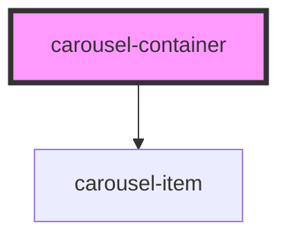

# carousel-container

<!-- Auto Generated Below -->

## Properties

| Property              | Attribute                | Description | Type             | Default     |
| --------------------- | ------------------------ | ----------- | ---------------- | ----------- |
| `autoPlayInterval`    | `auto-play-interval`     |             | `number`         | `undefined` |
| `items` _(required)_  | --                       |             | `CarouselItem[]` | `undefined` |
| `showNavButtons`      | `show-nav-buttons`       |             | `boolean`        | `true`      |
| `showNavDots`         | `show-nav-dots`          |             | `boolean`        | `true`      |
| `showStopStartButton` | `show-stop-start-button` |             | `boolean`        | `true`      |

## Events

| Event                 | Description | Type                                                 |
| --------------------- | ----------- | ---------------------------------------------------- |
| `clickDotButton`      |             | `CustomEvent<CarouselItem>`                          |
| `clickNextPrevButton` |             | `CustomEvent<{ type: string; item: CarouselItem; }>` |

## Dependencies

### Depends on

- [carousel-item](../carousel-item)

### Graph

----------------------------------------------

*Built with [StencilJS](https://stenciljs.com/)*
