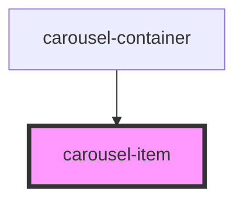

# carousel-item

<!-- Auto Generated Below -->

## Properties

| Property       | Attribute | Description | Type           | Default     |
| -------------- | --------- | ----------- | -------------- | ----------- |
| `selectedItem` | --        |             | `CarouselItem` | `undefined` |

## Events

| Event        | Description | Type                |
| ------------ | ----------- | ------------------- |
| `clickImage` |             | `CustomEvent<void>` |

## Dependencies

### Used by

 - [carousel-container](../carousel-container)

### Graph

----------------------------------------------

*Built with [StencilJS](https://stenciljs.com/)*
